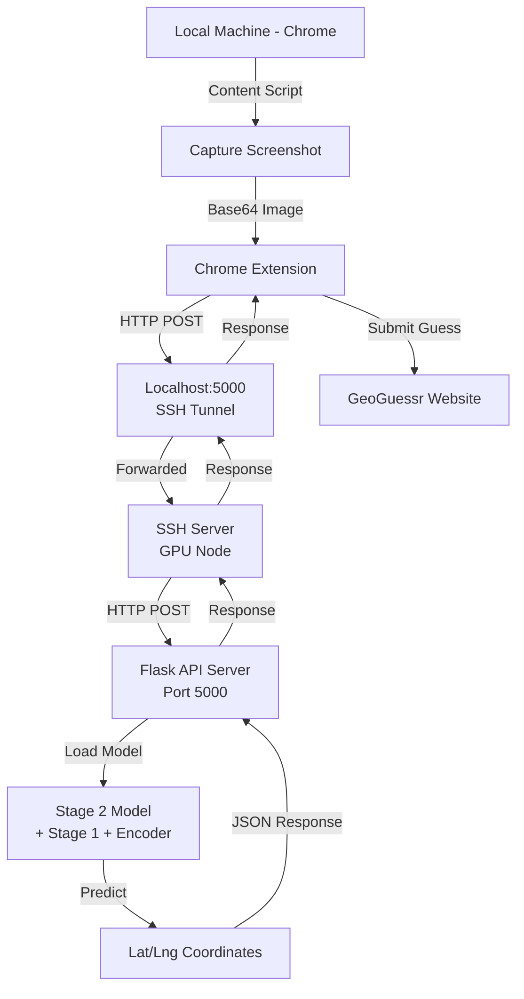

# Geoguessr Bot

The `chrome_extension` folder contains the Geoguessr bot that uses the Stage 2 cross-attention model to automatically play the game of Geoguessr. This system is designed to run the ML model on a remote SSH server (GPU node) while the Chrome extension runs on your local machine.

## Architecture



## System Requirements

### Remote SSH Server (GPU Node)
- Access to SLURM job scheduler
- GPU node with CUDA support
- Conda environment with PyTorch
- Stage 2 model checkpoint

### Local Machine
- **Chrome browser** (recommended) or Chromium-based browser
- SSH client with port forwarding capability
- Python 3.8+ with required packages (for GUI automation)
- Internet connection for GeoGuessr
- **Extension permissions**: Allow access to GeoGuessr domain

## Two Bot Approaches

### **Approach 1: Chrome Extension + Server ML (Recommended)**
- ✅ **Pros**: Works remotely, browser-independent, detailed logging
- ✅ **Cons**: Requires SSH tunneling setup
- **Use case**: Production deployment, remote GPU access

### **Approach 2: Local GUI Automation + Server ML (Hybrid) - RECOMMENDED**
- ✅ **Pros**: Works with any browser, no extension issues, local control, automatic game flow
- ✅ **Cons**: Requires Python locally, screen region calibration
- **Use case**: Best for most users - handles everything automatically

## Detailed Setup Guide

### Step 1: Verify Model Checkpoint Exists

On the SSH server, check that the Stage 2 checkpoint exists:

```bash
ls -la /scratch-shared/pnair/Project_AI/results/stage2_cross_attention_both/2025-12-25_09-13-54/checkpoints/best_model_stage2_xattn.pt
```

If it doesn't exist, you may need to:
1. Find the correct checkpoint path
2. Update the path in `jobs/bot/api_server.job`

### Step 2: Submit API Server Job

On the SSH server, submit the SLURM job:

```bash
cd /scratch-shared/pnair/Project_AI/
sbatch jobs/bot/api_server.job
```

The job will automatically install `flask-cors` for cross-origin request handling.

Check job status:
```bash
squeue -u $USER  # Should show your job running
```

Monitor the output log:
```bash
tail -f /scratch-shared/pnair/Project_AI/jobs/outputs/bot/api_server.log
```

Wait for the log to show:
```
Model loaded successfully. Starting Flask server...
```

**Troubleshooting job submission:**
- If the job fails with import errors, check that `flask-cors` installed correctly
- Verify the conda environment has all required packages

### Step 3: Verify API Server is Running

**IMPORTANT**: The SLURM job runs on a compute node (not the login node you're SSH'd into). You need to SSH to the compute node to test locally.

First, find which compute node your job is running on:
```bash
squeue -u $USER  # Look at NODELIST column (e.g., gcn95)
```

Then SSH to that compute node and test:
```bash
# SSH to your compute node (replace gcn95 with actual node)
ssh gcn95

# Check if Flask server is running
ps aux | grep api_server.py
netstat -tlnp | grep 5000  # Should show port 5000 listening

# Test the API server
curl -X POST http://localhost:5000/api/v1/predict \
  -H "Content-Type: application/json" \
  -d '{"image": "data:image/png;base64,iVBORw0KGgoAAAANSUhEUgAAAAEAAAABCAYAAAAfFcSJAAAADUlEQVR42mNk+M9QDwADhgGAWjR9awAAAABJRU5ErkJggg=="}'
```

Should return:
```json
{
  "results": {
    "lat": 0.0,
    "lng": 0.0
  }
}
```

**Exit the compute node** when done testing: `exit`

### Step 4: Set up SSH Port Forwarding

**IMPORTANT**: Keep this SSH connection open in a separate terminal window.

Since the SLURM job runs on a compute node (not the login node), you need to set up a multi-hop SSH tunnel. Here are two approaches:

#### **Option A: Multi-hop tunnel (Recommended)**

From your **local machine**, create a tunnel that goes through the login node to the compute node:

```bash
# First, find which compute node your job is running on (from Step 2)
# Then use this command:
ssh -L 5000:<compute-node>:5000 -N <username>@<login-node>
```

Example (replace `gcn102` with the actual compute node from `squeue`):
```bash
ssh -L 5000:gcn102:5000 -N pnair@snellius.surf.nl
```

#### **Option B: Two-step tunnel**

1. **From your local machine** (Terminal 1):
```bash
ssh -L 2222:localhost:22 -N pnair@snellius.surf.nl
```

2. **From another terminal on your local machine** (Terminal 2):
```bash
# Connect to login node via local port 2222, then tunnel to compute node
ssh -L 5000:<compute-node>:5000 -N -p 2222 localhost
```

**Options explained:**
- `-L 5000:<compute-node>:5000`: Forward local port 5000 to compute node port 5000
- `-N`: Don't execute remote commands, just forward ports
- `-p 2222`: Use local port 2222 for the SSH connection

**To find your compute node:**
```bash
squeue -u $USER  # Look at NODELIST column
```

The command should run silently. If it exits immediately, check:
- Job is still running: `squeue -u $USER`
- Correct compute node name
- Network connectivity

### Step 5: Verify Port Forwarding

On your **local machine**, test that port forwarding works:

```bash
curl -X POST http://localhost:5000/api/v1/predict \
  -H "Content-Type: application/json" \
  -d '{"image": "data:image/png;base64,iVBORw0KGgoAAAANSUhEUgAAAAEAAAABCAYAAAAfFcSJAAAADUlEQVR42mNk+M9QDwADhgGAWjR9awAAAABJRU5ErkJggg=="}'
```

Should return the same JSON response as in Step 3.

### Step 6: Download Chrome Extension Files

**On your local machine**, download the extension files:

```bash
# If you have access to the SSH server filesystem:
scp -r <username>@<ssh-server>:/scratch-shared/pnair/Project_AI/bot/chrome_extension ~/geoguessr-bot-extension

# Or download manually from your repository
```

### Step 7: Load Chrome Extension

1. **On your local machine**, open Chrome
2. Go to `chrome://extensions/`
3. Enable "Developer mode" (toggle in top right)
4. Click "Load unpacked"
5. Select the `chrome_extension` folder you downloaded/copied
6. Verify the extension is loaded and enabled

### Step 8: Test the System

1. **On your local machine**, navigate to https://www.geoguessr.com/game/
2. **Open Chrome DevTools** (F12) and go to the **Console** tab to see detailed bot activity
3. **Look for the blue "🤖 Bot Active" indicator** in the top-right corner of the page
4. The extension should automatically:
   - ✅ **Console logs**: Shows detailed status messages and predictions
   - ✅ **Visual indicator**: Blue "🤖 Bot Active" badge on the page
   - ✅ **Screenshot capture**: Screen briefly hides during capture
   - ✅ **API calls**: Sends images to ML model via SSH tunnel
   - ✅ **Predictions**: Receives and logs lat/lng coordinates
   - ✅ **Guess submission**: Automatically submits to GeoGuessr
   - ✅ **Round progression**: Continues to next round automatically

### Step 9: Monitor and Debug

**Check extension console:**
- Open Chrome DevTools (F12)
- Go to the Console tab
- Look for detailed bot activity with emojis:
  - 🤖 Bot startup and status messages
  - 🔄 Round progression updates
  - 📸 Screenshot capture confirmations
  - 🔮 ML model prediction requests/responses
  - 📍 Coordinate submissions to GeoGuessr
  - ✅ Success confirmations
  - ❌ Error messages and retry attempts

**Check API server logs:**
- On SSH server: `tail -f /scratch-shared/pnair/Project_AI/jobs/outputs/bot/api_server.log`

**Common issues:**
- Port forwarding not working: Check SSH connection, firewall rules
- SSH tunnel drops: Restart the SSH tunnel command
- Extension not loading: Verify manifest.json permissions
- Model errors: Check checkpoint path and dependencies
- CORS issues: Server now includes CORS headers automatically
- **Browser issues (Brave/Firefox):** Use Chrome/Chromium for best compatibility
- **Panorama not loading:** Clear browser cache, disable extensions, check internet
- **Street View 404 errors:** GeoGuessr panorama tiles not loading - refresh page
- Job fails: Check SLURM output logs and conda environment

### Browser Compatibility & Panorama Issues

**Using Brave/Firefox instead of Chrome:**
- **Switch to Google Chrome** for best compatibility
- **Brave browser**: Disable "Shields" for geoguessr.com
- **Firefox**: Not supported - requires Chromium-based browser for screenshot API
- Extension needs `chrome.tabs.captureVisibleTab` API

**Panorama Loading Issues (Street View 404 errors):**

**Immediate fixes:**
- **Refresh the page** (F5) - Often fixes tile loading issues
- **Clear browser cache** - Press Ctrl+Shift+R for hard refresh
- **Disable other extensions** - They might interfere with GeoGuessr
- **Try incognito mode** - Clean browser state, no extensions
- **Check internet connection** - Google Street View needs stable connection
- **Wait 10-20 seconds** - Some panoramas load slowly initially

**Bot won't start because panorama isn't loaded:**
- Console shows: `🔄 Round 1: Waiting for guess button...`
- But never progresses to: `✅ Round 1: Guess button found`
- **Solution**: Ensure panorama tiles load completely before bot activates

**Debug panorama loading:**
- Open Network tab in DevTools (F12)
- Look for successful `tile?` requests to `streetviewpixels-pa.googleapis.com`
- 404 errors mean tiles aren't loading → refresh page

### Maintaining the Connection

**If SSH tunnel disconnects:**
1. Kill any existing tunnel: `pkill -f "ssh -L 5000"`
2. Restart tunnel: `ssh -L 5000:localhost:5000 -N <username>@<ssh-server>`

**If API server job dies:**
1. Check job status: `squeue -u $USER`
2. Resubmit job: `sbatch jobs/bot/api_server.job`
3. Wait for model to load (can take 1-2 minutes)

**Keep both running:**
- SSH tunnel terminal (background with `-N` flag)
- API server job (monitor with `squeue`)

## Alternative: Local GUI Automation Approach

If SSH tunneling is problematic, use the **hybrid GUI approach** that combines local Python automation with your remote ML model.

### **Setup GUI Automation Bot (Recommended):**

1. **Download bot files:**
```bash
# Copy from SSH server to your local machine
scp pnair@snellius.surf.nl:/scratch-shared/pnair/Project_AI/bot/main_single_player.py .
scp pnair@snellius.surf.nl:/scratch-shared/pnair/Project_AI/bot/select_regions.py .
scp pnair@snellius.surf.nl:/scratch-shared/pnair/Project_AI/bot/geoguessr_bot.py .
scp pnair@snellius.surf.nl:/scratch-shared/pnair/Project_AI/bot/test_api.py .
```

2. **Install dependencies locally:**
```bash
pip install pyautogui pyyaml pillow requests pynput
```

3. **Start SSH tunnel (keep running):**
```bash
ssh -L 5000:gcn95:5000 -N pnair@snellius.surf.nl
```

4. **Test API connection:**
```bash
python test_api.py
# Should show: ✅ API working! Prediction: 8.xxxx, 80.xxxx
```

5. **Calibrate screen regions:**
```bash
python select_regions.py
# Follow prompts to click on panorama and map areas
```

6. **Open GeoGuessr in browser:**
- Go to: https://www.geoguessr.com/game/QLUS51V077CRN06h
- Wait for game to load

7. **Run the bot:**
```bash
python main_single_player.py
# Press Enter when ready, bot will play automatically!
```

### **How GUI Bot Works:**

1. **Screenshot capture**: Uses `pyautogui` to capture panorama region
2. **API prediction**: Sends to your ML server at `localhost:5000`
3. **Map clicking**: Converts lat/lng to screen coordinates and clicks
4. **Round progression**: Presses spacebar to continue

### **GUI Bot Features:**

- **No browser dependencies**: Works with any browser
- **Local control**: Easy to debug and modify
- **Screen calibration**: Adapts to your screen layout
- **Fallback handling**: Graceful error recovery

### **Comparing Approaches:**

| Feature | Chrome Extension | GUI Automation |
|---------|------------------|----------------|
| **Setup Complexity** | Medium (SSH tunnel) | Easy (local Python) |
| **Browser Compatibility** | Chrome/Chromium only | Any browser |
| **Remote GPU Access** | ✅ Full support | ✅ Via API |
| **Debugging** | Browser console | Python prints |
| **Visual Feedback** | Console + overlay | Screen clicks |
| **Error Recovery** | Automatic retries | Manual intervention |

**Choose GUI automation if you prefer local Python control and simpler setup!**

## API Details

### Endpoint

```
POST http://127.0.0.1:5000/api/v1/predict
```

### Request Format

```json
{
  "image": "data:image/png;base64,iVBORw0KGgo..."
}
```

### Response Format

```json
{
  "results": {
    "lat": 40.7128,
    "lng": -74.0060
  }
}
```

## Manual API Testing

You can test the API server directly:

```bash
# Encode an image to base64
base64 -w 0 image.jpg > image.b64

# Make API call
curl -X POST http://127.0.0.1:5000/api/v1/predict \
  -H "Content-Type: application/json" \
  -d @- << EOF
{
  "image": "data:image/jpeg;base64,$(cat image.b64)"
}
EOF
```

## Troubleshooting

### Extension Not Working

1. Check that the API server is running: `ps aux | grep api_server.py`
2. Verify port forwarding: `netstat -tlnp | grep 5000`
3. Check Chrome extension console for errors
4. Ensure you're on a GeoGuessr classic game page (not duel/battle-royale)

### Model Loading Errors

1. Verify the checkpoint path exists
2. Check that Stage 1 checkpoint (referenced in Stage 2) exists
3. Ensure proper conda environment activation

### Low Accuracy

The Stage 2 model provides geolocation predictions but accuracy varies by:
- Image quality and content
- Geographic region (better in populated areas)
- Current model training (can be improved with more/fresher data)

## Development

### Modifying the Extension

- `chrome_extension/manifest.json`: Extension configuration
- `chrome_extension/scripts/classic.js`: Main logic for classic GeoGuessr games
- `chrome_extension/scripts/duel.js`: Logic for duel/battle-royale modes

### Modifying the API Server

- `bot/api_server.py`: Flask server and model inference
- Uses the same model loading code as evaluation scripts
- Matches the API contract expected by the Chrome extension

### Updating Checkpoints

To use a different Stage 2 checkpoint, modify:
- `jobs/bot/api_server.job`: Update `STAGE2_CHECKPOINT` variable
- Ensure the checkpoint follows the expected format from Stage 2 training